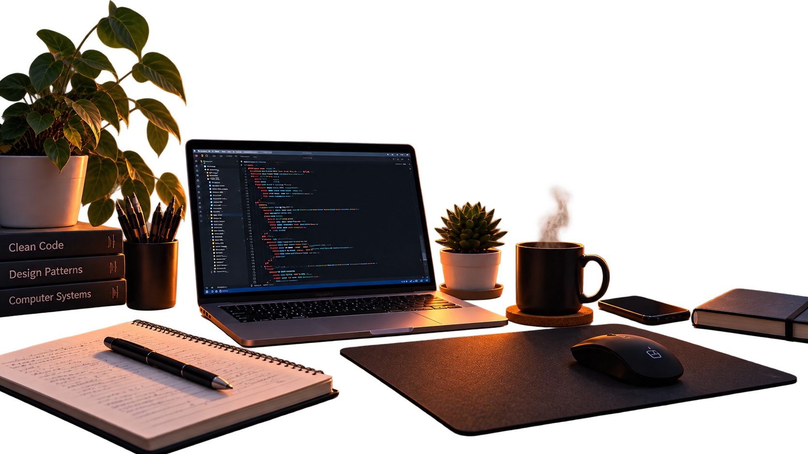

<p align="center">
    
    
    
    
    
    
    
    
    
</p>

```java
Developer marius = new Developer("Marius");

marius.languages = {"C/C++", "Java", "Python"};
marius.interests = {"Cybersecurity", "Networking", "Systems"};

while (marius.isLearning()) {
    marius.code();
    marius.debug();
    marius.repeat();
}
```

<h3 align="center">Connect with me</h3>
<hr>
<p align="center">
  <a href="mailto:mariuspopa234@gmail.com" >
    
  </a> &nbsp;&nbsp;
  
  <a href="https://www.linkedin.com/in/mariusspopaa/" target="_blank">
    
  </a> &nbsp;&nbsp;
  
  <a href="https://www.instagram.com/_marius.popa_" target="_blank">
    
  </a> &nbsp;&nbsp;
<p> 

